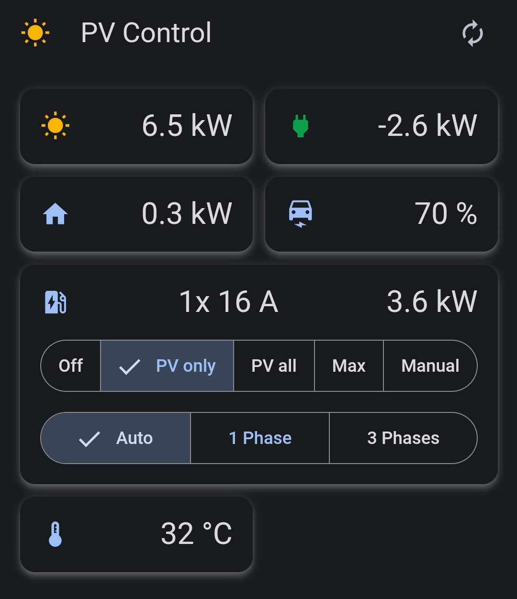
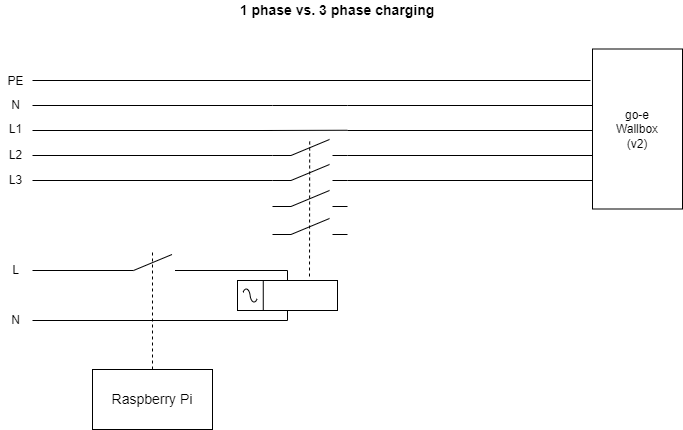

# pv-control

... controlling an electric car charger to charge from solar energy as efficient as possible.

For the deployment on a k8s cluster and the used hardware, see the related project [pv-monitoring](https://github.com/stephanme/pv-monitoring).

pv-control contains:
- A control loop implemented in Python that reads energy data from the inverter and sets the charge current of the wallbox.
- Some logic to control 1-phase vs 3-phase charging of the go-e wallbox via an external relay. Therefore, pv-control must run on a Raspberry PI.
- A we-connect client to read the SOC for an VW ID3.
- A number of REST endpoints to control the operation like setting charge mode and to get basic info about energy consumption.
- A simple UI implemented in Angular optimized for mobile phones.
- A Prometheus endpoint for monitoring the charging process.

PV-Control implements the following charge modes/strategies:
- OFF
- PV only - Try to charge with solar power only.
- PV all - Try to charge all available solar power into the car.
- Max - Charge with full power, i.e. 11 kW (3x 16A).
- Manual - Wallbox is manually controlled e.g. by the go-e app.

'PV only' and 'PV all' use different strategies when working around the limitations of the wallbox and electric car, i.e. the minimal charging current of 6A and the charging current steps of 1A.

Automatic phase switching between 1 and 3 phases for the PV modes is implemented but not yet tested in practice because my 7 kW peak solar power system gives little opportunity of 3 phase charging. Currently, the 'Auto' mode selects 1-phase charging for 'PV only' and 'PV all' and 3-phase charging for 'Max'.

## UI



## Wiring of Wallbox and Phase Switching Relay

A relay allows to switch between 1 phase and 3 phase charging. The control loop ensures that phase switching happens only when the wallbox is not charging. After switching, the go-e wallbox needs a reset.

Restarting pv-control (e.g. for updates) doesn't change the state of the relay. A reboot of the Raspberry initializes the relay to 1-phase charging.



## Configuration

```
python -m pvcontrol --help
usage: __main__.py [-h] [-m METER] [-w WALLBOX] [-a CAR] [-c CONFIG] [--host HOST] [--port PORT] [--basehref BASEHREF]

PV Control

optional arguments:
  -h, --help            show this help message and exit
  -m METER, --meter METER
  -w WALLBOX, --wallbox WALLBOX
  -a CAR, --car CAR
  -c CONFIG, --config CONFIG
  --host HOST           server host (default: 0.0.0.0)
  --port PORT           server port (default: 8080)
  --basehref BASEHREF   URL prefix to match ng base-href param (no leading /)
```

METER, WALLBOX and CAR refer to implementation classes for the energy meter, the wallbox and the car:
- METER = KostalMeter|FroniusMeter|SimulatedMeter
- WALLBOX = GoeWallbox|SimulatedWallbox|SimulatedWallboxWithRelay
- CAR = VolkswagenIDCar|SimulatedCar|NoCar

CONFIG is a json with 'meter', 'wallbox', 'car' and 'controller' configuration structures. The config parameters depend on the METER, WALLBOX and CAR type. See the corresponding ...Config data classes
in the source files `meter.py`, `wallbox.py`, `car.py` and `chargecontroller.py`.

HOST, PORT and BASEHREF configure the web server. BASEHREF can be used to add a prefix to the web server url so that it matches `ng build --base-href BASEHREF/` if not running behind an ingres on k8s. 

## Installation

Pre-requisites:
- Raspberry Pi 2 with Raspberry Pi OS Lite (Debian 11), or newer model
- [Raspberry Pi Expansion Board, Power Relay](https://www.waveshare.com/rpi-relay-board.htm)
- Python 3.9
- download `pv-control.tar.gz` package (release artifacts or from github actions)

The following procedure installs pvcontrol behind an nginx on port 80.

```
sudo apt install python3-pip

sudo mkdir -p /usr/local/bin/pvcontrol 
sudo tar -xzf pv-control.tar.gz -C /usr/local/bin/pvcontrol
cd /usr/bin/pvcontrol
pip install -r requirements.txt

sudo cp /usr/local/bin/pvcontrol/pvcontrol.service /etc/systemd/system
# adapt configuration in /etc/systemd/system/pvcontrol.service
sudo systemctl daemon-reload
sudo systemctl start pvcontrol.service
sudo systemctl enable pvcontrol.service

sudo apt install nginx
sudo cp /usr/local/bin/pvcontrol/pvcontrol.nginx /etc/nginx/sites-available/pvcontrol.nginx
# adapt pvcontrol.nginx if needed (e.g. multiple apps running on same raspi)
sudo ln -s /etc/nginx/sites-available/pvcontrol.nginx /etc/nginx/sites-enabled/pvcontrol.nginx
sudo rm /etc/nginx/sites-enabled/default
sudo systemctl start nginx

# journalctl -u pvcontrol.service -f
# http://pvcontrol.fritz.box
```

pvcontrol can be updated using the `update-pvcontrol.sh` script. Prerequisites:
- gh cli installed as described in https://github.com/cli/cli/blob/trunk/docs/install_linux.md
- successful github login, e.g. with `gh auth login -w`
- pvcontrol was installed as described above
- `update-pvcontrol.sh` script copied into home directory of raspberry

## Installation on k8s

Tested on Raspberry Pi 4 with Raspberry Pi OS Lite (Debian 11, 64 bit).

Example k8s yamls for deploying pv-control:
- https://github.com/stephanme/pv-control/blob/main/pvcontrol.yaml
- https://github.com/stephanme/pv-monitoring/blob/main/pvcontrol/pvcontrol.yaml

## Development

pv-control contains a number of mock implementations for wallbox and inverter/power meter to allow testing and local development.

Basic setup:
- Python 3.9 (use pyenv and create a virtual env pv-control-3.9)
- a recent version of node and npm (see Angular requirements)

How to run locally:
```
# in pv-control/ui
npm install
ng build

# in pv-control
pyenv activate pv-control-3.9
pip install -r requirements.txt
python -m pvcontrol

# http://localhost:8080
```

How to run Python tests:
```
pip install -r requirements-dev.txt
python -m flake8
python -m unittest discover -s ./tests
```

How to run UI tests:
```
# in pv-control/ui
ng lint
npm run test
```

For reproducible builds, requirements.txt shall pin all packages using [pip-compile](https://github.com/jazzband/pip-tools).
Update Python deps:
```
# pyenv activate pv-control-3.9
python -m pip install --upgrade pip
pip install -r requirements-dev.txt -U
pip-compile --upgrade --resolver backtracking --allow-unsafe requirements.in

# edit requirements.txt and add/edit platform specific dependencies: RPi.GPIO, fake-rpi, numpy
pip install -r requirements.txt -U
```

## CI and Release

A docker container [stephanme/pv-control](https://hub.docker.com/r/stephanme/pv-control/tags) is built for every commit via github actions. The arm image is intended to run on a k8s cluster on a Raspberry node.
