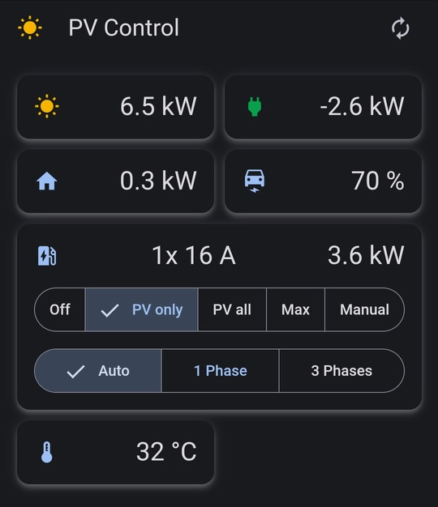

# pv-control

... controlling an electric car charger to charge from solar energy as efficient as possible.

For the setup and used hardware, see the related project [pv-monitoring](https://github.com/stephanme/pv-monitoring).

pv-control contains:
- A control loop implemented in Python that reads energy data from the inverter and sets the current of the wallbox.
- Some logic to control 1-phase vs 3-phase charging of the go-e wallbox via an external relay. Therefore, pv-control must run on a Raspberry PI.
- A we-connect client to read the SOC for an VW ID3.
- A number of REST endpoints to control the operation like setting charge mode and to get basic info about energy consumption.
- A simple UI implemented in Angular optimized for mobile phones.
- A Prometheus endpoint for monitoring the charging process.

PV-Control implements the following charge modes/strategies:
- OFF
- PV only - Try to charge with solar power only.
- PV all - Try to charge all available solar power into the car.
- Max - Charge with full power, i.e. 11 kW (3x 16A).
- Manual - Wallbox is manually controlled e.g. by the go-e app.

'PV only' and 'PV all' use different strategies when working around the limitations of the wallbox and electric car, i.e. the minimal charging current of 6A and the charging current steps of 1A.
Automatic phase switching between 1 and 3 phases for the PV modes is implemented but not yet tested in practice because my 7 kW peak solar power system gives little opportunity of 3 phase charging.

## UI



## Configuration

```
python -m pvcontrol --help
usage: __main__.py [-h] [-m METER] [-w WALLBOX] [-a CAR] [-c CONFIG]

PV Control

optional arguments:
  -h, --help            show this help message and exit
  -m METER, --meter METER
  -w WALLBOX, --wallbox WALLBOX
  -a CAR, --car CAR
  -c CONFIG, --config CONFIG
```

METER, WALLBOX and CAR refer to implementation classes for the energy meter, the wallbox and the car:
- METER = KostalMeter|SimulatedMeter
- WALLBOX = GoeWallbox|SimulatedWallbox|SimulatedWallboxWithRelay
- CAR = VolkswagenIDCar|SimulatedCar

CONFIG is a json with 'meter', 'wallbox', 'car' and 'controller' configuration structures. The config parameters depend on the METER, WALLBOX and CAR type. See the corresponding ...Config data classes
in the source files `meter.py`, `wallbox.py`, `car.py` and `chargecontroller.py`.

Examle k8s yamls for deploying pv-control:
- https://github.com/stephanme/pv-control/blob/main/pvcontrol.yaml
- https://github.com/stephanme/pv-monitoring/blob/main/pvcontrol/pvcontrol.yaml

## Development

pv-control contains a number of mock implementations for wallbox and inverter/power meter to allow testing and local development.

Basic setup:
- Python 3.7 (use pyenv)
- a recent version of node and npm (see Angular requirements)

How to run locally:
```
# in pv-control/ui
npm install
ng build

# in pv-control
pip install -r requirements.txt
python -m pvcontrol

# http://localhost:8080
```

How to run Python tests:
```
pip install -r requirements-dev.txt
python -m flake8
python -m unittest discover -s ./tests
```

How to run UI tests:
```
# in pv-control/ui
ng lint
npm run test
```

## CI and Relase

A docker container [stephanme/pv-control](https://hub.docker.com/r/stephanme/pv-control/tags) is built for every commit via github actions. The arm image is intended to run on a k8s cluster on a Raspberry node.
